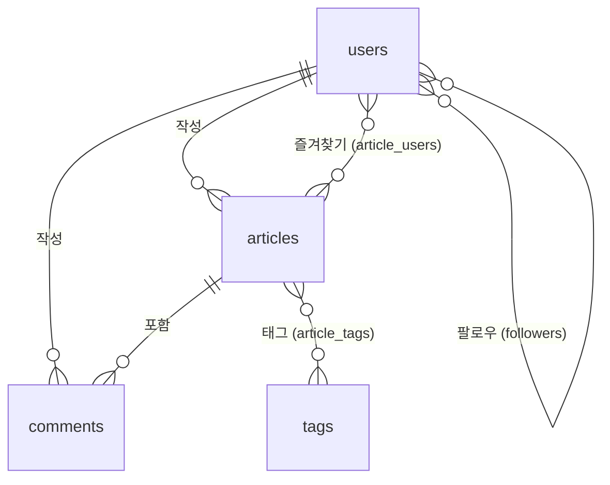

# ADR-005: 데이터베이스 스키마 설계

## 상태
승인

## 배경
RealWorld 명세에 정의된 도메인 모델(사용자, 글, 댓글, 태그, 팔로우, 즐겨찾기)을 관계형 DB로 설계해야 한다.

## 결정
MySQL을 프로덕션 DB로, SQLite in-memory를 테스트 DB로 사용하며, 아래 스키마를 적용한다.

## 스키마 설계

### 핵심 테이블

#### users
| 컬럼 | 타입 | 설명 |
|------|------|------|
| id | bigint (PK) | 자동 증가 |
| name | string | 사용자명 (unique) |
| email | string | 이메일 (unique) |
| password | string | Bcrypt 해시 |
| bio | text (nullable) | 자기소개 |
| avatar_url | string (nullable) | 프로필 이미지 URL |
| email_verified_at | timestamp (nullable) | 이메일 인증일 |
| remember_token | string (nullable) | 자동 로그인 토큰 |
| created_at, updated_at | timestamps | 생성/수정 시각 |

#### articles
| 컬럼 | 타입 | 설명 |
|------|------|------|
| id | bigint (PK) | 자동 증가 |
| title | string | 제목 |
| slug | string (indexed) | URL 슬러그 (자동 생성) |
| content | text | 본문 |
| excerpt | text (nullable) | 요약 |
| state | string (default: 'draft') | 상태 (draft/published) |
| user_id | FK → users | 작성자 (nullOnDelete) |
| created_at, updated_at | timestamps | 생성/수정 시각 |

#### comments
| 컬럼 | 타입 | 설명 |
|------|------|------|
| id | bigint (PK) | 자동 증가 |
| content | text | 댓글 내용 |
| user_id | FK → users | 작성자 (nullOnDelete) |
| article_id | FK → articles | 대상 글 (nullOnDelete) |
| created_at, updated_at | timestamps | 생성/수정 시각 |

#### tags
| 컬럼 | 타입 | 설명 |
|------|------|------|
| id | bigint (PK) | 자동 증가 |
| name | string | 태그명 |
| slug | string (indexed) | URL 슬러그 (자동 생성) |

### 피벗 테이블

#### article_users (즐겨찾기)
| 컬럼 | 타입 | 설명 |
|------|------|------|
| id | bigint (PK) | 자동 증가 |
| article_id | FK → articles | 대상 글 |
| user_id | FK → users | 즐겨찾기한 사용자 |

#### article_tags
| 컬럼 | 타입 | 설명 |
|------|------|------|
| id | bigint (PK) | 자동 증가 |
| article_id | FK → articles | 대상 글 |
| tag_id | FK → tags | 태그 |
| created_at, updated_at | timestamps | 생성/수정 시각 |

#### followers (팔로우)
| 컬럼 | 타입 | 설명 |
|------|------|------|
| id | bigint (PK) | 자동 증가 |
| user_id | FK → users | 팔로우 대상 |
| followed_by_id | FK → users | 팔로우한 사용자 |

## 관계 다이어그램

## 설계 원칙
- 외래 키에 `nullOnDelete()` 사용: 참조 데이터 삭제 시 NULL 설정 (cascade 삭제 방지)
- 인덱스: slug 컬럼에 인덱스 추가 (URL 조회 성능)
- Tags 테이블에 timestamps 없음 (불변 데이터)

## 영향
- `nullOnDelete`로 인해 삭제된 사용자의 글/댓글이 고아 레코드로 남을 수 있음
- 피벗 테이블에 unique 제약 조건이 없어 중복 가능 (코드 레벨에서 `firstOrCreate`로 방지)

## 대안
- `cascadeOnDelete`: 참조 데이터 삭제 시 관련 레코드 자동 삭제. 데이터 손실 위험
- Soft Delete: 논리 삭제. 복잡도 증가하나 데이터 보존 가능
