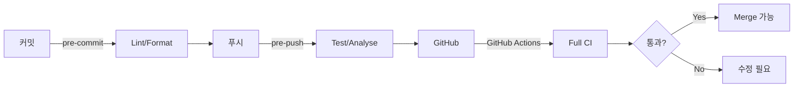

# ADR-008: CI/CD 전략 (Git Hooks + GitHub Actions)

## 상태
승인

## 배경
코드 품질 자동화와 지속적 통합을 위한 CI/CD 전략이 필요하다. 로컬 개발 환경에서의 사전 검증과 원격 저장소에서의 자동 검증을 모두 다뤄야 한다.

## 결정
2단계 품질 자동화를 적용한다:
1. **로컬:** Git Hooks (Husky + lint-staged)
2. **원격:** GitHub Actions CI 파이프라인

## Git Hooks (로컬 검증)

### pre-commit
- PHP-CS-Fixer: PHP 파일 코드 스타일 검사
- ESLint: JavaScript/Vue 파일 린트
- Prettier: 프론트엔드 코드 포맷팅
- 문서 전용 변경 시 바이패스

### pre-push
- PHPUnit 테스트 실행
- PHPStan 정적 분석

### 도구
- Husky: Git Hooks 관리
- lint-staged: 스테이징된 파일만 검사

## GitHub Actions (원격 검증)

### 트리거
- `push`: main 브랜치
- `pull_request`: main 브랜치 대상

### 작업 (Jobs)

#### 1. PHP Tests
- PHP 8.0 설정
- Composer 의존성 설치 (캐시 활용)
- PHPUnit 테스트 실행

#### 2. PHP Quality
- PHP-CS-Fixer 검증 (dry-run)
- PHPStan 정적 분석

#### 3. Frontend Quality
- Node.js 설정
- npm 의존성 설치 (캐시 활용)
- ESLint 검사
- 프론트엔드 빌드 검증

## 파이프라인 흐름

## 영향
- 커밋/푸시 시 로컬 검증으로 약간의 지연 발생
- 모든 개발자가 Node.js 환경 필요 (Husky)
- GitHub Actions 무료 사용량 내에서 운영

## 대안
- GitHub Actions만 사용: 로컬 검증 없이 원격만. 피드백 루프 느림
- GitLab CI: GitHub 이외 플랫폼. 현재 GitHub 사용 중이므로 부적합
- CircleCI: 유사 기능이나 추가 서비스 의존
