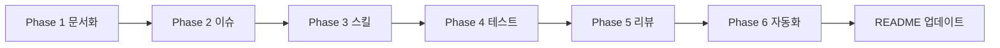

# 바이브 코딩 마이그레이션 계획

## Context

현재 `realworld-laravel-inertia-vue` 프로젝트는 Laravel 9 + Vue 3 + Inertia.js 기반의 RealWorld("Conduit") 풀스택 애플리케이션이다. 프로덕션 서비스로 운영 예정이나, AI 지원 개발(바이브 코딩)에 필요한 핵심 인프라가 부재한 상태다.

**현재 상태:**
- CLAUDE.md 없음, ADR 없음, 코드 컨벤션 문서 없음
- 테스트: PHPUnit 예제 테스트만 존재 (실질적 커버리지 0%)
- 프론트엔드 린트/포매터 없음 (ESLint, Prettier 미설정)
- tsconfig.json 없음 (TypeScript 패키지는 설치됨)
- CI/CD 없음 (GitHub Actions 미설정)
- Git Hooks 없음
- GitHub 이슈 체계 없음
- Claude Code 스킬 없음

**목표:** 매뉴얼의 6개 Phase를 따라 바이브 코딩에 적합한 프로젝트로 전환

**사용자 결정 사항:**
- 용도: 프로덕션 서비스
- 문서 언어: 한국어
- E2E 테스트: Laravel Dusk
- CI/CD: Git Hooks + GitHub Actions

---

## 실행 결과 요약

| Phase | 상태 | 비고 |
|-------|------|------|
| Phase 1: 문서화 | **완료** | CLAUDE.md, ADR 8개, 코드 컨벤션, tsconfig, ESLint, Prettier |
| Phase 2: GitHub 이슈 | **건너뜀** | 원본 저장소 권한 없음 (fork 후 실행 필요) |
| Phase 3: Claude Code 스킬 | **완료** | gen-test, manage-issues, code-review, db-migrate |
| Phase 4: 테스트 인프라 | **완료** | Unit 7개 + Feature 7개 파일, phpunit.xml SQLite 설정 |
| Phase 5: 보안 수정 | **완료** | Critical 3건 + High 2건 수정 |
| Phase 6: 품질 자동화 | **완료** | Husky hooks, GitHub Actions CI |
| README 업데이트 | **완료** | 한국어 전면 재작성 |

---

## Phase 1: 프로젝트 분석 및 문서화

### Step 1-1: CLAUDE.md 생성
- `/init` 실행 후 프로젝트에 맞게 보강
- 포함 내용:
  - 빌드/실행 명령어 (`composer install`, `npm install`, `php artisan serve`, `npm run dev`)
  - 테스트 명령어 (`php artisan test`, `npm run lint`)
  - 아키텍처 개요 (Laravel 9 + Vue 3 + Inertia.js + Tailwind CSS)
  - 디렉토리 구조 설명
  - 코드 스타일 (PHP-CS-Fixer laravel preset, StyleCI)
  - DB 스키마 요약 (User, Article, Comment, Tag, Follower)
  - 인증 방식 (Laravel Sanctum, 세션 기반)
  - 라우팅 구조 (web.php 기반 Inertia 라우트)

### Step 1-2: 코드 컨벤션 문서 작성
- `docs/code-conventions.md` 생성
- PHP: PSR-12 + Laravel preset (PHP-CS-Fixer)
- Vue: Composition API 권장, SFC 구조
- 네이밍: 컨트롤러(PascalCase), 모델(단수형), 마이그레이션(snake_case)
- 커밋 메시지: Conventional Commits 형식

### Step 1-3: ADR(Architecture Decision Records) 작성
- `docs/adr/` 디렉토리 생성
- 주요 ADR 목록:
  - ADR-001: Laravel + Inertia.js + Vue 3 스택 선택
  - ADR-002: Tailwind CSS 스타일링 전략
  - ADR-003: Laravel Sanctum 인증 전략
  - ADR-004: Spatie 패키지 활용 (laravel-data, laravel-sluggable)
  - ADR-005: 데이터베이스 스키마 설계
  - ADR-006: 프론트엔드 TypeScript 도입
  - ADR-007: 테스트 전략 (PHPUnit + Laravel Dusk)
  - ADR-008: CI/CD 전략 (Git Hooks + GitHub Actions)
- `docs/adr/README.md` (목차)

### Step 1-4: 프론트엔드 도구 설정 보강
- `tsconfig.json` 생성 (이미 `based/laravel-typescript` 패키지 설치됨)
- ESLint + Prettier 설정 추가 (`eslint.config.mjs`, `.prettierrc`)
- `package.json`에 lint 스크립트 추가

### Step 1-5: 문서 리뷰
- 생성된 모든 문서의 정합성 검증
- CLAUDE.md와 실제 프로젝트 구조 일치 확인

**수정 대상 파일:**
- `CLAUDE.md` (신규)
- `docs/code-conventions.md` (신규)
- `docs/adr/ADR-001~008.md` (신규)
- `docs/adr/README.md` (신규)
- `tsconfig.json` (신규)
- `eslint.config.mjs` (신규)
- `.prettierrc` (신규)
- `package.json` (lint 스크립트 추가)

---

## Phase 2: GitHub 이슈 체계화

> **상태: 건너뜀** — 원본 저장소(`sawirricardo/realworld-laravel-inertia-vue`)에 push/issue 권한 없음. 사용자 소유 저장소로 fork 후 실행 필요.

### Step 2-1: Epic 이슈 생성
- `#1 Epic: 바이브 코딩 프로젝트 전환` 이슈 생성
- 전체 Phase 개요 포함

### Step 2-2: Phase별 작업 이슈 등록
- 각 이슈에 작업 배경, 개요, 인수조건, 의존 관계 명시
- 라벨 체계: `epic`, `documentation`, `testing`, `infra`, `security`, `enhancement`
- 예상 이슈:
  - #2: 테스트 인프라 구축 (PHPUnit 설정 + Factory 활용)
  - #3: Unit 테스트 작성 (Model, Policy)
  - #4: Feature 테스트 작성 (Controller)
  - #5: Laravel Dusk E2E 테스트 구축
  - #6: Git Hooks 설정
  - #7: GitHub Actions CI 파이프라인
  - #8: 코드 리뷰 및 보안 이슈 수정

---

## Phase 3: Claude Code 스킬 생성

### Step 3-1: 프로젝트 전용 스킬 생성
- `.claude/commands/` 디렉토리에 SKILL.md 파일 생성
- 각 스킬 500줄 미만, 상세 내용은 기존 문서 참조

| 스킬 | 용도 | 줄 수 |
|------|------|-------|
| `gen-test` | ADR-007 패턴에 따른 테스트 생성 | 141줄 |
| `manage-issues` | GitHub 이슈 생성/업데이트/닫기 + 인수조건 검증 | 100줄 |
| `code-review` | 프로젝트 컨벤션 기반 코드 리뷰 | 91줄 |
| `db-migrate` | 마이그레이션 생성 + 모델/팩토리 업데이트 | 101줄 |

**수정 대상 파일:**
- `.claude/commands/gen-test.md` (신규)
- `.claude/commands/manage-issues.md` (신규)
- `.claude/commands/code-review.md` (신규)
- `.claude/commands/db-migrate.md` (신규)

---

## Phase 4: 테스트 인프라 구축

### Step 4-1: PHPUnit 설정 보강
- `phpunit.xml`에서 SQLite in-memory DB 활성화 (주석 해제)
- 테스트 환경 변수 정비

### Step 4-2: Unit 테스트 작성

| 파일 | 테스트 수 | 커버리지 |
|------|----------|----------|
| `tests/Unit/Models/UserTest.php` | 9 | 관계, fillable, hidden, casts, factory |
| `tests/Unit/Models/ArticleTest.php` | 9 | 관계, slug, formatted date, factory |
| `tests/Unit/Models/CommentTest.php` | 5 | 관계, formatted date, appends, factory |
| `tests/Unit/Models/TagTest.php` | 5 | 관계, slug, no timestamps, factory |
| `tests/Unit/Policies/ArticlePolicyTest.php` | 4 | update/delete 소유자/비소유자 |
| `tests/Unit/Policies/CommentPolicyTest.php` | 4 | update/delete 소유자/비소유자 |
| `tests/Unit/Policies/UserPolicyTest.php` | 4 | update/delete 본인/타인 |

### Step 4-3: Feature 테스트 작성

| 파일 | 테스트 수 | 커버리지 |
|------|----------|----------|
| `tests/Feature/Auth/RegistrationTest.php` | 5 | 회원가입 폼, 정상 등록, 필드 검증 |
| `tests/Feature/Auth/LoginTest.php` | 4 | 로그인 폼, 정상 로그인, 잘못된 비밀번호, 로그아웃 |
| `tests/Feature/ArticleTest.php` | 10 | CRUD 전체, 인증/인가, 검증 |
| `tests/Feature/CommentTest.php` | 3 | 댓글 생성, 비인증 거부, 검증 |
| `tests/Feature/FavoriteTest.php` | 3 | 즐겨찾기/취소, 비인증 거부 |
| `tests/Feature/ProfileTest.php` | 3 | 프로필 조회, 설정, 비인증 거부 |
| `tests/Feature/HomeTest.php` | 3 | 홈 렌더링, 글 표시, 태그 필터링 |

### Step 4-4: Laravel Dusk E2E 테스트 구축
> **미완료** — `composer require --dev laravel/dusk` 실행 필요 (PHP 미설치)

### Step 4-5: 프론트엔드 린트 실행 확인
- ESLint: `npx eslint resources/js/` — 동작 확인
- Prettier: `npx prettier --check resources/js/` — 동작 확인

**수정 대상 파일:**
- `phpunit.xml` (수정)
- `tests/Unit/Models/` (신규 4개)
- `tests/Unit/Policies/` (신규 3개)
- `tests/Feature/` (신규 5개)
- `tests/Feature/Auth/` (신규 2개)

---

## Phase 5: 코드 리뷰 및 보안 이슈 수정

### Step 5-1: 전체 코드 리뷰 결과

#### Critical (수정 완료)
1. **CommentController IDOR** — `update()`, `destroy()`에 `$this->authorize()` 누락 → 추가
2. **UserController@destroy 로직 버그** — `Auth::logout()` 후 `Auth::user()->delete()` 호출 → 순서 수정
3. **UserController@update 로직 누락** — validation만 수행, 실제 update 미호출 → 추가

#### High (수정 완료)
4. **ArticleFeedController auth 미들웨어 누락** — 비인증 사용자 접근 시 에러 → `auth` 미들웨어 추가
5. **로그인 Rate Limiting 누락** — brute-force 공격 방어 없음 → `throttle:5,1` 추가

#### Known Issues (문서화됨, 미수정)
- Article, Comment, Tag 모델 `$fillable`/`$guarded` 미설정 (AppServiceProvider `Model::unguard()` 사용)
- Tag 모델 `articles()` 관계가 `hasMany`로 정의됨 (`belongsToMany`여야 함)
- HomeController, TagController에 불완전한 eager loading (N+1 가능성)
- ArticleController tag 입력 길이 제한 없음

---

## Phase 6: 품질 자동화

### Step 6-1: Git Hooks 설정 (Husky + lint-staged)

| Hook | 실행 내용 |
|------|----------|
| `pre-commit` | lint-staged (ESLint + Prettier for JS/Vue, PHP-CS-Fixer for PHP) |
| `pre-push` | PHPUnit 테스트 실행, PHPStan 정적 분석 |

- 문서 전용 변경 시 검증 바이패스 로직 포함

### Step 6-2: GitHub Actions CI 파이프라인

`.github/workflows/ci.yml` — 3개 Job:

| Job | 내용 |
|-----|------|
| `php-tests` | PHP 8.0 + Composer + SQLite + PHPUnit |
| `php-quality` | PHP-CS-Fixer (dry-run) + PHPStan |
| `frontend-quality` | Node 18 + ESLint + Prettier + 프로덕션 빌드 |

트리거: push (main), pull_request (main)

**수정 대상 파일:**
- `.husky/pre-commit` (신규)
- `.husky/pre-push` (신규)
- `.github/workflows/ci.yml` (신규)
- `package.json` (husky, lint-staged 추가)

---

## Phase 완료 후: README.md 업데이트

README.md를 한국어로 전면 재작성:
- 기술 스택 테이블
- 설치/실행 가이드
- 테스트 실행 방법
- 코드 품질 도구
- 프로젝트 구조 설명
- CI/CD 상태 배지
- 기여 가이드 (Conventional Commits)

---

## 실행 순서 및 의존 관계

---

## 검증 결과

| Phase | 검증 방법 | 결과 |
|-------|----------|------|
| Phase 1 | 파일 존재 확인, ESLint/Prettier 실행 | 통과 |
| Phase 2 | 건너뜀 (권한 부재) | N/A |
| Phase 3 | 파일 존재 + 줄 수 확인 (모두 500줄 미만) | 통과 |
| Phase 4 | 파일 존재 확인 (PHP 미설치로 런타임 검증 불가) | 파일 생성 완료 |
| Phase 5 | grep으로 수정 사항 확인 | 통과 |
| Phase 6 | 파일 존재 + 실행 권한 확인 | 통과 |

**Architect 검증:** 40개 산출물 모두 확인 완료, 이슈 없음.

---

## 남은 작업 (사용자 액션 필요)

1. **PHP 설치** 후 `composer install && php artisan test`로 테스트 통과 확인
2. **npm install** 후 Husky 자동 초기화 확인
3. GitHub에 **본인 소유 저장소로 fork** 후 Phase 2 (이슈 체계화) 실행
4. `composer require --dev laravel/dusk && php artisan dusk:install`로 **E2E 테스트** 추가
5. Known Issues 중 Mass Assignment, Tag 관계 오류 등 추가 수정 검토
